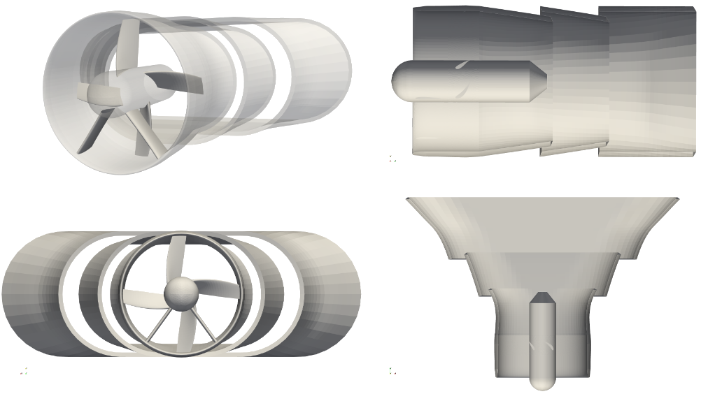

Demonstration
=============

Documentation of the demonstration cases located in 
`demo <https://github.com/ihs-ustutt/dtOO/tree/main/demo>`_.

Kinetic Turbine ``canada``
--------------------------

The free-flow machine is shown in :numref:`canada-over`. The entire diffuser
and the shrouding in the guide vane and runner area have a constant wall
thickness.  The guide vanes in the figure (top left) are arranged downwards and
have a V-shape with an angle of 72°. The runner blades are positioned next to
them in downstream direction.  The diffuser has a constant maximum height.
Therefore, the arrangement of the three-parted diffuser has no section
projected to the flow direction in the upper and lower areas. The figure shows
the vents oriented towards the axis of rotation in the upper area (top right)
and the vents pointing away from the axis of rotation on the side (bottom
left). The edges of the corresponding diffuser sections are straight. The hub
is spherical in front of the guide vane inlet and conical at the diffuser
inlet. For the design, only runner and diffuser are variable; the guide vane is
fixed and does not direct the flow. As a result, the inflow to the runner is
swirl-free.

.. _canada-over:

   Three-dimensional representation of the kinetic turbine (top left) with two
   guide vanes arranged at the bottom and four rotor blades; diffuser is
   designed in three parts; machine's side view without blades (top right);
   view from the front (bottom left); top view without blades (bottom right)

:numref:`canada-res` shows a simulation result of an optimized machine. The
streamlines are coloured with the velocitie's magnitude. Backflow regions are
visulaized as magenta coloured iso volumes. According to figure
:numref:`canada-res`, the flow enters the machine through the inlet section
and, additionally, throuth the vents. Behind the hub only small vortices occur.
The flow follows the opening of the diffuser. According to theoretical
considerations, the optimized machine shows a flap at the end of the third
diffuser section.

.. _canada-res:
.. figure:: img/canada_res_nobg.png
   :width: 300
   :align: center

   Three-dimensional representation of the kinetic turbine (top left) with two
   guide vanes arranged at the bottom and four rotor blades; diffuser is
   designed in three parts; machine's side view without blades (top right);
   view from the front (bottom left); top view without blades (bottom right)

Parameterization
^^^^^^^^^^^^^^^^

:numref:`canada-dt-para` shows the parameterization of the diffuser geometry.
The guide vane and runner area is marked by the rectangle drawn as a dash-dot
line. For the design of the kinetic turbine, the control points shown are fixed
(empty rectangle) or movable (filled rectangle). Each gray part of the diffuser
is defined by a B-spline of second order. The first and last spline each have
three movable and one fixed control point. The former fulfills the constraint
of a smooth transition from the guide vane and runner area to the diffuser
shape, the latter limits the horizontal (:math:`x`-direction) expansion of the
diffuser. The transition from the guide vane and runner area to the diffuser
can be made differentiable by fixing the second control point in the
:math:`x`-direction. All three control points in the second diffuser section
can be moved. The first point in each of the first and third diffuser part can
only be moved in the :math:`x`-direction.  The overlap in :math:`z`-direction
of the parts is fixed. Overall, the diffuser is parameterized with :math:`15`
degrees of freedom (DOF). In the following, DOFs in the :math:`x`-direction are
denoted by :math:`E_{p,q}` and in the :math:`z`-direction by :math:`L_{p,q}`.
With the index :math:`p`, the first, second and third diffuser section is
characterized by the indices :math:`0`, :math:`1` and :math:`2`, respectively.
The second index :math:`q` corresponds to the first to fourth and first to
third control points per diffuser section by the indices :math:`0.0`,
:math:`1.0`, :math:`1.5` and :math:`2.0` and :math:`0.0`, :math:`1.0` and
:math:`2.0`, respectively.

:numref:`canada-dt-para` also contains parts of the unstructured mesh blocks
(black solid line). The remaining parts within the investigated area (black
dotted line) is meshed with a block structured approach. In this case, the
hybrid mesh reduces the number of cells and the complexity of the block
structure. An adequate number of elements is required upstream and downstream
of the hub, which is, in case of a pure block structured approach, completely
imprinted on the inflow section. Due to the small hub in relation to the
diffuser, fewer elements are generally required near the hub than on the
diffuser. The unstructured areas decouple the mesh. In addition, the geometric
deformation of the diffuser mesh in the :math:`x`-direction can be compensated
by tightening the inner blocks. This results in more tetrahedral elements; at
the same time, the hexahedrons remain more uniform in the structured areas.

.. _canada-dt-para:
.. figure:: img/canada_dt_para_nobg.png
   :width: 500
   :align: center

   Schematic representation of the kinetic turbine in half-sided view with
   boundaries (gray) and the bladed space (black dash-dotted line); control
   points (rectangles) are fixed (empty) or moveable (filled); unstructured
   grid blocks drawn as black solid line; coupling (black dotted line) to the
   coarsely meshed far field via a general grid interface

:numref:`canada-ru-para` contains the parameterization of a mid-surface section
for the runner. Each section is defined by four DOFs. The outlet angle
:math:`\beta_o` and the position or sickling in the circumferential direction
:math:`\phi r_o` can be changed. The index :math:`o` indicates the position of
the cut in the spanwise direction.
The distribution of the thickness is

.. math::
   :label: naca-eq

   y(t,T) = T \left( 
       0.2969 \sqrt{t} 
     − 0.1260 t 
     − 0.3516 t^2 
     + 0.2843 t^3 
     − 0.1015t^4 
     − 0.0021t^4 
   \right)

where :math:`t` follows the parameter value of the meanline. Additionally, the
parameter :math:`s` shifts the maximum thickness :math:`T` to the inlet or
outlet. This means that only symmetrical thickenings can be generated.

.. _canada-ru-para:
.. figure:: img/canada_ru_para_nobg.png
   :width: 300
   :align: center

   Control polygon (black dashed) of the center line (black solid) with fixed 
   (empty) and movable (filled) control points; entry and exit angles 
   :math:`\alpha_o` and :math:`\beta_o` as well as deflection 
   :math:`r_o` can be changed; position of the profile in circumferential 
   direction can be changed via DOF :math:`\phi r_o`

The runner blade is generated from three sections parameterized according to
:numref:`canada-ru-para`. :numref:`canada-ru3d-para` shows a schematic sketch
of the three-dimensional blade. Visible edges are shown as thick black lines,
hidden edges as thin gray lines and mid-surface sections as dotted lines. The
three directions :math:`\underline{e}_{\phi r}`, :math:`\underline{e}_m` and
:math:`\underline{e}_r` correspond to the arrows on the hub section. The
sections at the hub (:math:`s=0`), center (:math:`s=0.5`) and shroud
(:math:`s=1`) used for the structure or index :math:`o=0`, :math:`o=1` and
:math:`o=2` are connected by a B-Spline surface.  According to
:numref:`canada-ru3d-para`, the span direction is not necessarily the radial
direction. Depending on the shape of the hub and the shroud, the span direction
goes according to the rotating surface that defines the blade channel.

.. _canada-ru3d-para:
.. figure:: img/canada_ru3d_para_nobg.png
   :width: 300
   :align: center

   Three-dimensional view of the impeller blade from three sections; hub
   section (thin black) with corresponding directional arrows; span direction
   of the blade (dashed directional arrow)

The maximum thickening :math:`T` of the mean line or mean surface from equation
:eq:`naca-eq` is variable in spanwise direction. A blending 

.. math::

  T(s) = T_0 + (T_1 - T_0) h(s)

with the blending function :math:`h(s)` is defined by the fixed maximum
thickenings :math:`T_0` and :math:`T_1` at the hub and shroud.
:numref:`canada-ru-blending` visualizes the function

.. math::

   h(s) 
   = 
   c_0 
   - 
   c_1 \frac{ 
     \mathrm{tanh} \left( G (sC - 1) \right)
   }
   {
     \mathrm{tanh}(G)
   }

with 

.. math::

   c_0 
   = 
   \frac{
     \mathrm{tanh} G
   }
   {
     \mathrm{tanh} \left( G (C - 1) \right) + \mathrm{tanh} G
   }

and 

.. math::

   c_1 = - \frac{\mathrm{tanh} G}{\mathrm{tanh} [G(C - 1)] + \mathrm{tanh} G}

for different parameter values of :math:`G` and :math:`C`. For :math:`G = 0.01`
and :math:`C = 2`, the result is a linear blending that corresponds to the
black dots. An increase in :math:`G` bulges the blending symmetrically and
makes it "s"-shaped according to the dashed lines from white to black. Changing
:math:`C` creates asymmetrical blending in the direction of the hub or shroud
(color gradient from dark to light). The steeper the gradient of :math:`h(s)`,
the faster the change in thickening in the spanwise direction.

.. _canada-ru-blending:

   Blending function of the thickness distribution; linear blending shown as
   black dots; variation of :math:`G` and :math:`C` shown by dashed lines and
   color gradient, respectively

Parameter symbols and labels
""""""""""""""""""""""""""""

:numref:`map-dof-lab` gives the mapping between math symbols and
:ref:`constValue` labels. Additionally, the min and max values for each
DOF is shown. It is important to mention that all DOFs are scaled. Therefore,
the values does not directly correspond to an angle or a length.

.. _map-dof-lab:
.. csv-table:: Mapping between math symbol and :ref:`constValue` label for DOFs 
               including min and max values
   :header: "Symbol", "Label", "Min", "Max"
   :widths: 10, 20, 10, 10
   :escape: #
   :align: center

   :math:`r_0`              ,``cV_ru_ratio_0.0``        , 0.05 , 0.8 
   :math:`r_1`              ,``cV_ru_ratio_0.5``        , 0.2  , 0.9 
   :math:`r_2`              ,``cV_ru_ratio_1.0``        , 0.2  , 0.8 
   :math:`\phi r_0`         ,``cV_ru_offsetPhiR_ex_0.0``, -0.04, 0.4 
   :math:`\phi r_1`         ,``cV_ru_offsetPhiR_ex_0.5``, -0.04, 0.4 
   :math:`\phi r_2`         ,``cV_ru_offsetPhiR_ex_1.0``, -0.04, 0.4 
   :math:`\alpha_1`         ,``cV_ru_alpha_1_ex_0.0``   , -0.2 , 0.3 
   :math:`\alpha_2`         ,``cV_ru_alpha_1_ex_0.5``   , -0.2 , 0.2 
   :math:`\alpha_3`         ,``cV_ru_alpha_1_ex_1.0``   , -0.2 , 0.2 
   :math:`\beta_1`          ,``cV_ru_alpha_2_ex_0.0``   , -0.2 , 0.3 
   :math:`\beta_2`          ,``cV_ru_alpha_2_ex_0.5``   , -0.2 , 0.3 
   :math:`\beta_3`          ,``cV_ru_alpha_2_ex_1.0``   , -0.2 , 0.2 
   :math:`\Delta L_{0#,1}`  ,``cV_deltaL_dt_1``         , -0.10, 0.6 
   :math:`\Delta L_{0#,1.5}`,``cV_deltaL_dt_1.5``       , 0.1  , 0.9 
   :math:`\Delta E_{0#,1.5}`,``cV_deltaE_dt_1.5``       , 0.05 , 0.7 
   :math:`\Delta E_{0#,2}`  ,``cV_deltaE_dt_2``         , 0.05 , 0.4 
   :math:`\Delta L_{1#,0}`  ,``cV_deltaL_dt2_0``        , 0.2  , 0.4 
   :math:`\Delta L_{1#,1}`  ,``cV_deltaL_dt2_1``        , 0.1  , 0.9 
   :math:`\Delta E_{1#,0}`  ,``cV_deltaE_dt2_0``        , 0.05 , 0.2 
   :math:`\Delta E_{1#,1}`  ,``cV_deltaE_dt2_1``        , -0.10, 0.9 
   :math:`\Delta E_{1#,2}`  ,``cV_deltaE_dt2_2``        , 0.1  , 0.9 
   :math:`\Delta L_{2#,0}`  ,``cV_deltaL_dt3_0``        , 0.3  , 0.72
   :math:`\Delta L_{2#,1}`  ,``cV_deltaL_dt3_1``        , 0.1  , 0.9 
   :math:`\Delta E_{2#,0}`  ,``cV_deltaE_dt3_0``        , 0.05 , 0.1 
   :math:`\Delta E_{2#,1}`  ,``cV_deltaE_dt3_1``        , -0.10, 0.9 
   :math:`\Delta L_{2#,1.5}`,``cV_deltaL_dt3_1.5``      , 0.25 , 0.99
   :math:`\Delta E_{2#,1.5}`,``cV_deltaE_dt3_1.5``      , 0.25 , 0.99
   :math:`T`                ,``cV_thick_x``             , 0.20 , 0.8 
   :math:`G`                ,``cV_thick_g``             , 0.01 , 5.0 
   :math:`C`                ,``cV_thick_c_3``           , 0.30 , 3.0

Simulation setup
^^^^^^^^^^^^^^^^

The simulation area of the kinetic turbine consists of an area close to the
turbine and a far field. :numref:`canada-case-over` shows the calculation area
schematically. The far-field contains the dotted area near the turbine. A
Dirichlet boundary condition for the velocity and a gradient boundary condition
for the pressure are shown at the inlet :math:`(E)`; correspondingly, a
gradient boundary condition and a Dirichlet boundary condition are specified at
the outlet :math:`(A)`.  The connection of the near-turbine field with the
far-field is made via a generalized mesh interface at the coupling surfaces
:math:`(F_1, G_1)`, :math:`(F_2, G_2)` and :math:`(F_3, G_3)`. By meshing the
two areas separately, it is possible to mesh the far-field area more coarsely
and, thus, save computation time. The two boundary surfaces at the top and
bottom of the far field (both summarized in :math:`(N)`) are defined as a
frictionless wall.  The detail at the bottom right of
:numref:`canada-case-over` shows the area close to the turbine with the guide
vane and runner area as well as the subsequent diffuser. The guide vane,
runner, hub and diffuser are only drawn in half section due to symmetry. All
:math:`(S)` boundary surfaces are walls with a noslip condition. The part of
the :math:`(S)` surface in the runner area (hub part and blade) rotates
according to the angular velocity. The coupling surface :math:`(F_4, G_4)` at
the runner inlet is also a generalized mesh interface.  There is a
circumferential interface between the guide vane and runner :math:`(L_5, M_5)`
or runner and diffuser :math:`(L_6, M_6)`.

.. _canada-case-over:
.. figure:: img/canada_case_over_nobg.png
   :width: 600
   :align: center

   Schematic representation of the simulation area consisting of near-field
   (dotted cone) and far-field (dashed rectangle); boundary conditions shown on
   boundary surfaces (letters without indices) and coupling surfaces (letters
   with indices); guide vane (LE) and runner (LA) area including diffuser and
   hub (both dashed gray) in detail

Running the case
^^^^^^^^^^^^^^^^

Pull and run the latest stable container by:

.. code-block:: bash

  docker pull atismer/dtoo:stable
  docker run -it atismer/dtoo:stable

Change to the case directory by

.. code-block:: bash

  cd /dtOO/demo/canada

and list the directory's files by:

.. code-block:: bash
   
   ls
   E1_12685.xml  Mesh  build.py  geo  gmshMeshFile  init.xml  machine.xml  machineSave.xml  xml

The kinetic turbine is setup with the old XML (Extensible Markup Language)
interface of the framework. Therefore, the main XML file ``machine.xml``, the
state files ``machineSave.xml`` and ``E1_12685.xml`` as well as the files
located in directory ``xml`` are necessary to create the machine. The ``Mesh``
directory contains the fixed far-field mesh in CGNS format.

Using ``build.py`` script
"""""""""""""""""""""""""

The `Python script
<https://github.com/ihs-ustutt/dtOO/blob/main/demo/canada/build.py>`_
automatically creates the predefined state ``E1_12685`` of the kinetic
turbine. It is executed within the container by:

.. code-block:: bash

   python3 build.py

The first part of the script controls the framework. First the framework is
imported with

.. code-block:: python

   from dtOOPythonSWIG import *

and the log file ``build.log`` is created with

.. code-block:: python

   logMe.initLog("build.log")

As previously described, the kinetic turbine is created using the XML
interface. The input and state XML file is loaded by the parser with

.. code-block:: python
   
   dtXmlParser.init("machine.xml", "E1_12685.xml")

and a reference to the parser is kept in the variable ``parser`` by

.. code-block:: python
 
   parser = dtXmlParser.reference()

Afterwards both XML files are parsed 

.. code-block:: python

   parser.parse()

and the construction plan of the machine is read. All objects are stored in STL
(C++ Standard Template Library) like objects. And those objects have to be
created for base ojects, DOFs, functions, geometries, mesh parts, simulation
cases and plugins by, respectively, 

.. code-block:: python

   bC = baseContainer()
   cV = labeledVectorHandlingConstValue()
   aF = labeledVectorHandlingAnalyticFunction()
   aG = labeledVectorHandlingAnalyticGeometry()
   bV = labeledVectorHandlingBoundedVolume()
   dC = labeledVectorHandlingDtCase()
   dP = labeledVectorHandlingDtPlugin()

before objects can be appended to the containers. All DOFs are created by the
parser's function:

.. code-block:: python

   parser.createConstValue(cV)

The specific state (put simply: the values of the DOFs) is loaded to the DOFs
by:

.. code-block:: python

   parser.loadStateToConst("E1_12685", cV)

All other objects are created by executing the command:

.. code-block:: python

   parser.destroyAndCreate(bC, cV, aF, aG, bV, dC, dP)

At this point, the complete machine is available within the containers. The last
step is to create the meshes and setup the simulation case by:

.. code-block:: python

   dC.get("ingvrudtout_coupled_of").runCurrentState()
  
This step may take a while, because the whole meshing procedure is performed.

.. note::

   It is necessary that you have to set two MPI environment variables.  This is
   necessary because within the container you are ``root``. This has to be done
   before running any simulation by:

   .. code-block:: bash  

     export OMPI_ALLOW_RUN_AS_ROOT=1
     export OMPI_ALLOW_RUN_AS_ROOT_CONFIRM=1

The second part is the simulation of the flow field using OpenFOAM. In order to
also handle this in Python, the PyFoam library is used. The import
package by

.. code-block:: python

   from PyFoam.Applications.Decomposer import Decomposer
   from PyFoam.Applications.WriteDictionary import WriteDictionary
   from PyFoam.Applications.Runner import Runner
   from PyFoam.Applications.ClearCase import ClearCase
   from PyFoam.Applications.PackCase import PackCase

and definition of the case and state name

.. code-block:: python

   caseName = "ingvrudtout_coupled_of"
   stateName = "E1_12685"

provides the necessary functions and attributes to call PyFoam. For the kinetic
turbine the simulation cases are created as folders according to the pattern:

.. code-block:: bash

   ingvrudtout_coupled_of_<stateLabel>

``<stateLabel>`` represents the name of the currently loaded state. At first, the
case is decomposed by

.. code-block:: python

   Decomposer(
     args=[
       caseName+"_"+stateName,"4","--method=scotch","--clear","--silent"
     ]
   )

and then ready to simulate the first 100 iterations as a laminar problem by:

.. code-block:: python

  WriteDictionary(
     args=[caseName+"_"+stateName+"/system/controlDict", "endTime", "100"]
   )
   WriteDictionary(
     args=[caseName+"_"+stateName+"/system/controlDict", "writeInterval", "100"]
   )
   WriteDictionary(
     args=[
       caseName+"_"+stateName+"/constant/turbulenceProperties", 
       "RAS['turbulence']", 
       "off"
     ]
   )
   Runner(
     args=[
       "--silent", 
       "--autosense-parallel", 
       "simpleFoam", "-case", caseName+"_"+stateName
     ]
   )

The second step is the following simulation of 900 iterations as a turbulent
problem by executing

.. code-block:: python

   WriteDictionary(
     args=[caseName+"_"+stateName+"/system/controlDict", 
       "endTime", "1000"
     ]
   )
   WriteDictionary(
     args=[
       caseName+"_"+stateName+"/system/controlDict", 
       "writeInterval", "1000"
     ]
   )
   WriteDictionary(
     args=[
       caseName+"_"+stateName+"/constant/turbulenceProperties", 
       "RAS['turbulence']", "on"
     ]
   )
   Runner(
     args=[
       "--silent", 
       "--autosense-parallel", 
       "simpleFoam", "-case", caseName+"_"+stateName
     ]
   ) 

and 

.. code-block:: python

   Runner(
     args=[
       '--silent', 
       'reconstructPar', '-latestTime', "-case", caseName+"_"+stateName
     ]
   )

to reconstruct the parallel simulation case. The two commands

.. code-block:: python

   ClearCase(
     [
       '--keep-postprocessing', 
       '--processors-remove', 
       '--remove-analyzed', 
       '--keep-postprocessing', 
       '--clear-history', 
       '--keep-last', 
       caseName+"_"+stateName
     ])

and

.. code-block:: python

   PackCase([caseName+"_"+stateName, '--last'])

are optional. They clear and pack the simulation case. This is useful when
performing an optimization and save disk space.  

Creating an own state
"""""""""""""""""""""

The creation of a new state of the kinetic turbine starts similar to the
previous method using ``build.py``. At first, the framework, the parser and the
container have to be defined by:

.. code-block:: python
  :emphasize-lines: 40

   from dtOOPythonSWIG import *
   logMe.initLog("build.log")
   dtXmlParser.init("machine.xml", "E1_12685.xml")
   parser = dtXmlParser.reference()
   parser.parse()
   bC = baseContainer()
   cV = labeledVectorHandlingConstValue()
   aF = labeledVectorHandlingAnalyticFunction()
   aG = labeledVectorHandlingAnalyticGeometry()
   bV = labeledVectorHandlingBoundedVolume()
   dC = labeledVectorHandlingDtCase()
   dP = labeledVectorHandlingDtPlugin()
   parser.createConstValue(cV)

It is good practice to start from an existing state. Therefore, we use the
``E1_12685`` state as initialization for all DOFs:

.. code-block:: python

   parser.loadStateToConst("E1_12685", cV)

At this point the DOFs are created and initialized. It can also be validated by:

.. code-block:: python

   parser.currentState()
   >>> 'E1_12685'

The output is exactly the loaded state. We can start to modify any
:ref:`constValue` listed in :numref:`map-dof-lab`. One can easily iterate over
all defined DOFs within a simple `for`-loop:

.. code-block:: python

   for i in cV:
     print(i.getLabel())
   >>> cV_n
   [...]
   >>> cV_ru_alpha_1_ex_0.0
   [...]
   >>> cV_ru_stepNResplinePoints

Somewhere in the long list we found the inlet angle at the hub that is
labelled as ``cV_ru_alpha_1_ex_0.0`` according to :numref:`map-dof-lab`. A
call of the ``()``-operator

.. code-block:: python

   cV["cV_ru_alpha_1_ex_0.0"]()
   >>> 0.04964900016784668

gives the current value of the DOF. We can change the angle by:

.. code-block:: python

   cV["cV_ru_alpha_1_ex_0.0"].setValue(0.05)

It is important to update the geometry of the runner mesh channel when the
blade geometry is changed. Otherwise the mesh might not be correctly generated.
The update is performed by:

.. code-block:: python

   dP.get("ru_adjustDomain").apply()

Put simply, the command adjusts other  dependent DOFs to generate a valid mesh.
Checking again the state by

.. code-block:: python

   parser.currentState()
   >>> ''

shows that the current state is empty. We create a new state and validate that
everything works correctly by:

.. code-block:: python

   parser.setState("iahr2024_state")
   parser.currentState()
   >>> 'iahr2024_state'

Optionally, we can extract the state and create a new state file by:

.. code-block:: python

   parser.extract("iahr2024_state", cV, "iahr2024_state.xml")

This creates the XML file ``iahr2024_state.xml`` within the directory. If no
new file is desired, a call to

.. code-block:: python

   parser.write(cV)

inserts the new state in the currently loaded state file (``E1_12685.xml``).
From this point, we can generate the whole machine by

.. code-block:: python

   parser.destroyAndCreate(bC, cV, aF, aG, bV, dC, dP)

and create the case directory by

.. code-block:: python

   dC.get("ingvrudtout_coupled_of").runCurrentState()

Of course, we also have to adjust the variable names, if we still use the 
above explained commands:

.. code-block:: python

   caseName = "ingvrudtout_coupled_of"
   stateName = "iahr2024_state"

Additionally, we have to simulate the new case written in the directory
``ingvrudtout_coupled_of_iahr2024_state``.
