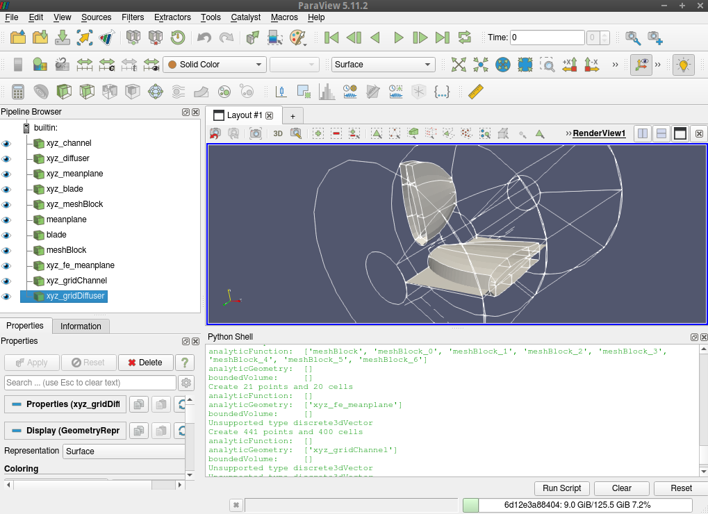

Quickstart
==========

The fastest way of trying dtOO is by using the image.

.. code-block:: bash

  docker pull atismer/dtoo:latest

You can then simply un the container by executing:

.. code-block:: bash

  docker run -it dtoo

If you would like to see the machine, it is possible to open ``paraview`` in
the container. Therefore, you have to execute on the host

.. code-block:: bash

  xhost +local:*

before runing the container by:

.. code-block:: bash

  run -it -e DISPLAY=$DISPLAY -v /tmp/.X11-unix/:/tmp/.X11-unix/ dtoo

Within the container navigate to the demo case:

.. code-block:: bash

  cd /dtOO/demo/simpleAxialRunner

If you start your container with additional options for runing a GUI
application, you can open ``paraFOAM`` and investigate the runner. 
Additionally, you can investigate the geometry of the machine by:

.. code-block:: bash

  zypper install paraview
  export PYTHONPATH=/dtOO/demo/simpleAxialRunner:$PYTHONPATH
  paraview

Then, just open the ``Python Shell`` and type:

.. code-block:: python

  from simpleAxialRunner import *
  CreateAndShow()

You will see this:

If you would like to simulate the machine just run the ``doctest`` by:

.. code-block:: python

  python3 -m doctest simpleAxialRunner.py

The geometry, mesh and simulation case is automatically created. Additionally,
the simulation is performed. After a few minutes, you will see a folder named
``of_DD-MM-YYYY_HH:MM:SS`` that is the correspoding ``OpenFOAM`` case. ``D``, 
``M``, ``Y``, ``H``, ``M`` and ``S`` stands for, respectively, day, month, 
year, hours, minutes and seconds.
